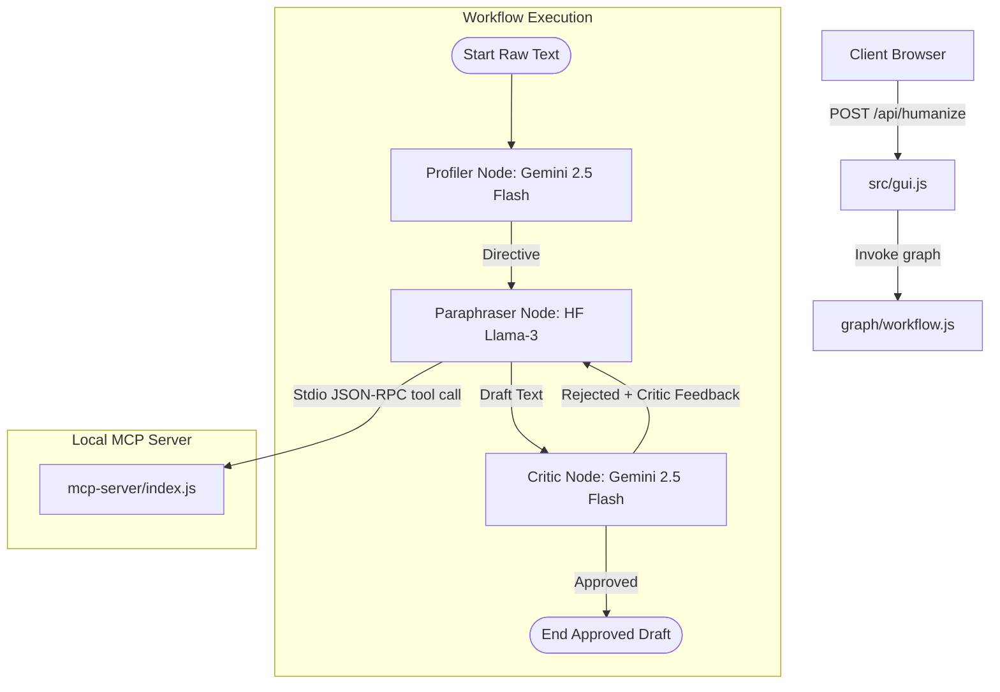

# Plain Language Agent Repository State & Architecture Log

This document tracks the current state, architecture, component inventory, and future roadmap of the **Plain Language Agent** repository.

---

## 1. Project Overview & Scope
The Plain Language Agent is a dual-interface text-rewriting application that modifies complex institutional documents (medical discharge instructions, legal contracts, government forms) to meet plain language readability standards.
- **Target Grade Levels:** Grade 6 (Healthcare/Children), Grade 8 (General Government/Public), and Grade 10 (Legal/Technical Professional).
- **GUI Interface:** Serves an interactive retro-terminal UI over HTTP featuring target grade selection, a readability metrics panel with simplification delta, and an execution log dashboard.
- **MCP Server Interface:** Exposes the `get_plain_language_patterns` tool to retrieve word-replacement rules.
- **Agentic Workflow:** Employs a multi-agent LangGraph workflow (Profiler -> Paraphraser -> Critic) to process, rewrite, and evaluate text iteratively.

**Model Migration:**
- The **Profiler** and **Critic** agents are powered by **Gemini 2.5 Flash** (via `@langchain/google-genai`).
- The **Paraphraser** remains powered by **Llama-3** (via `@huggingface/inference`).

---

## 2. Current Architecture & Data Flow

1. **GUI HTTP Server (src/gui.js):** Runs an HTTP static server and API route handlers (triggers the StateGraph workflow). Port reads from `process.env.PORT || 3000`. Returns `result`, `plainText`, `readabilityScores`, and `gradeLevel`.
2. **Profiler (Gemini 2.5 Flash):** Computes initial Flesch-Kincaid grade level as `readabilityScores.before`. Calls Gemini to identify sentences over 25 words, passive voice, jargon, and nominalizations to produce a structured directive.
3. **Paraphraser (meta-llama/Meta-Llama-3-8B-Instruct):** Queries the local MCP server over stdio via `get_plain_language_patterns` with the `gradeLevel` parameter. Generates `state.draftText` using Llama-3, guided by the rules and the Profiler directive.
4. **Critic (Gemini 2.5 Flash):** Calculates the new readability level as `readabilityScores.after`. Throttled by a 2000ms delay. Implements a hard score gate (approving immediately if score $\le$ target). Otherwise, runs Gemini to verify plain language compliance, rejecting with constructive feedback or approving.
5. **Local MCP Server (mcp-server/index.js):** Exposes `get_plain_language_patterns` mapping to `gradeLevel` ("6", "8", "10") returning pattern replacements from `src/patterns.js`.

---

## 3. Directory & File Inventory

The repository is structured as follows:

- **`src/`** (Pure Vanilla JS sources):
  - [src/index.js](file:///workspaces/agentic-humanizer/src/index.js): Main dual-bootstrapper (MCP stdio server and GUI daemon startup). Loads `.env` variables at start.
  - [src/gui.js](file:///workspaces/agentic-humanizer/src/gui.js): HTTP static server and API route handlers (triggers the StateGraph workflow).
  - [src/humanize.js](file:///workspaces/agentic-humanizer/src/humanize.js): Rule-based pipeline runner.
  - [src/patterns.js](file:///workspaces/agentic-humanizer/src/patterns.js): Constant dictionaries of style replacements mapped by grade levels.
  - [src/readability.js](file:///workspaces/agentic-humanizer/src/readability.js): Flesch-Kincaid metric calculator.
  - [src/logger.js](file:///workspaces/agentic-humanizer/src/logger.js): Logging helper.
  - [src/errors.js](file:///workspaces/agentic-humanizer/src/errors.js): App validation and processing exceptions.
- **`mcp-server/`** (Local MCP server):
  - [mcp-server/index.js](file:///workspaces/agentic-humanizer/mcp-server/index.js): Exposes the `get_plain_language_patterns` tool.
- **`agents/`** (LangGraph workflow nodes):
  - [agents/profiler.js](file:///workspaces/agentic-humanizer/agents/profiler.js): Gemini-powered complexity analyzer.
  - [agents/paraphraser.js](file:///workspaces/agentic-humanizer/agents/paraphraser.js): Connects to MCP patterns server, and paraphrases text using Llama-3 over HF.
  - [agents/critic.js](file:///workspaces/agentic-humanizer/agents/critic.js): Evaluates compliance using score gate and Gemini review.
- **`graph/`** (Vanilla JS workflow definition):
  - [graph/workflow.js](file:///workspaces/agentic-humanizer/graph/workflow.js): Defines StateGraph using Plain JS configuration.

---

## 4. Execution & Verification

The GUI and workflow execute natively:
- `npm start` / `node src/index.js --gui`: Starts HTTP server on port 3000 and stdio MCP server, loading `.env` variables successfully.
