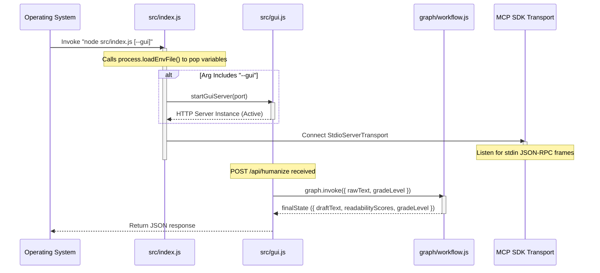
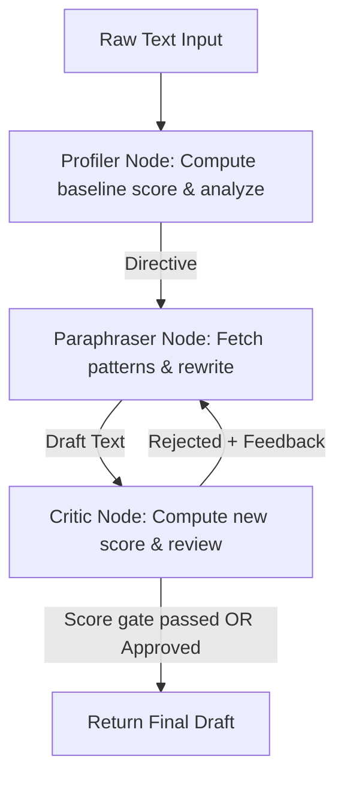

# Plain Language Agent & MCP Server: Architectural Blueprint & Technical Breakdown

This document provides a textbook-level architectural breakdown of the **Plain Language Agent & MCP Server** codebase. It is designed to get a Principal Systems Architect or Senior Staff Engineer up to speed on the core business domain, system boundaries, code skeleton, execution mechanics, and operational complexities.

---

## Phase 1: The Executive Blueprint

### 1. The Core Problem
Complex institutional text—such as medical discharge instructions, legal contracts, insurance policies, and government forms—often uses vocabulary and syntax that is difficult for general audiences or patients to understand.

This repository solves this problem by providing an **agentic plain language compliance tool** that rewrites complex text to meet Flesch-Kincaid readability standards. It targets Grade 6 for healthcare/children, Grade 8 for general public/government (the US Plain Writing Act standard), and Grade 10 for legal/technical professional documents. It tracks Flesch-Kincaid readability metrics, calculates and displays the simplification delta, and functions both as an **interactive web-based GUI** and as an **integration-ready Model Context Protocol (MCP) server**.

### 2. High-Level Tech Stack

```mermaid
graph TD
    subgraph Client Tier
        Browser[Client Browser / Retro-Terminal UI]
        MCPClient[MCP Client e.g. Claude Desktop / Antigravity]
    end

    subgraph Host Application (Node.js/ES6 Engine)
        Index[src/index.js - Main Entry Point]
        GuiServer[src/gui.js - HTTP Server]
        MCPServer[mcp-server/index.js - MCP SDK Server]
        Workflow[graph/workflow.js - LangGraph Orchestrator]
    end

    subgraph LangGraph Multi-Agent Workflow
        Profiler[agents/profiler.js - Gemini 2.5 Flash]
        Paraphraser[agents/paraphraser.js - meta-llama/Meta-Llama-3-8B-Instruct]
        Critic[agents/critic.js - Gemini 2.5 Flash]
    end

    Browser -->|HTTP POST /api/humanize| GuiServer
    MCPClient -->|STDIO JSON-RPC 2.0| MCPServer
    GuiServer -->|Invoke workflow| Workflow
    Workflow --> Profiler
    Profiler -->|Directive| Paraphraser
    Paraphraser -->|Draft Text| Critic
    Critic -->|Rejected + Feedback| Paraphraser
    Critic -->|Approved| Workflow
    Paraphraser -.->|Fetch patterns tool call| MCPServer
```

*   **Runtime:** Node.js (v20 Alpine).
*   **Language:** Vanilla JavaScript (ES6 ESModules).
*   **Protocol Support:** Model Context Protocol (MCP) SDK v1.x (via JSON-RPC over `stdio` transport).
*   **Agentic Orchestration:** `@langchain/langgraph` (v1.x) managing StateGraph cycles.
*   **Inference Pipeline:**
    *   **Gemini 2.5 Flash** (via `@langchain/google-genai` using `GOOGLE_API_KEY`) for Profiler and Critic nodes.
    *   **Llama-3-8B-Instruct** (via `@huggingface/inference` using `HUGGINGFACEHUB_API_TOKEN`) for the Paraphraser node.
*   **Validation:** Zod (`z`) for runtime request validation and MCP tool schema checking.

---

## Phase 2: The Skeleton & Entry Points

### 1. Macro Directory Structure
The workspace is structured entirely in ES6 vanilla JS modules:

- **`/src`**: Contains primary bootstrapper code.
    - [`index.js`](file:///workspaces/agentic-humanizer/src/index.js): Main CLI execution context and MCP SDK Server setup (loads `.env` variables at boot time).
    - [`gui.js`](file:///workspaces/agentic-humanizer/src/gui.js): Embedded HTTP server and API router (triggers the LangGraph workflow). Exposes static HTML GUI.
    - [`humanize.js`](file:///workspaces/agentic-humanizer/src/humanize.js): Heuristic rules-based pipeline.
    - [`patterns.js`](file:///workspaces/agentic-humanizer/src/patterns.js): Pattern dictionaries mapped to target grade levels.
    - [`readability.js`](file:///workspaces/agentic-humanizer/src/readability.js): Flesch-Kincaid metric calculator.
    - [`logger.js`](file:///workspaces/agentic-humanizer/src/logger.js): Simple global logger.
    - [`errors.js`](file:///workspaces/agentic-humanizer/src/errors.js): App validation and processing exceptions.
- **`/mcp-server`**: Contains local MCP components.
    - [`index.js`](file:///workspaces/agentic-humanizer/mcp-server/index.js): Exposes the `get_plain_language_patterns` tool with strict Zod validation.
- **`/agents`**: LangGraph nodes.
    - [`profiler.js`](file:///workspaces/agentic-humanizer/agents/profiler.js): Gemini-powered complexity analyzer that calculates the initial grade score and creates the directive.
    - [`paraphraser.js`](file:///workspaces/agentic-humanizer/agents/paraphraser.js): Rewrites draft using Llama-3 and MCP-fetched pattern rules.
    - [`critic.js`](file:///workspaces/agentic-humanizer/agents/critic.js): Performs score-gate checks and qualitative Gemini reviews.
- **`/graph`**: LangGraph state definitions.
    - [`workflow.js`](file:///workspaces/agentic-humanizer/graph/workflow.js): StateGraph compilation.

### 2. Execution Entry Points & Lifecycle
The application lifecycle begins at [`src/index.js`](file:///workspaces/agentic-humanizer/src/index.js).



---

## Phase 3: Data Flow & Agentic Mechanics

### 1. The Multi-Agent Plain Language Loop
When a rewrite request hits the HTTP API router, the data undergoes loop-based processing:



### 2. State & Channels
The StateGraph state is defined with vanilla JavaScript config channels:
- `rawText`: The input machine-written text.
- `directive`: Instruction guideline set by the profiler and amended with feedback by the critic.
- `draftText`: The working copy of the simplified output.
- `status`: Transition flag (`"approved"` or `"rejected"`) evaluated by the critic.
- `gradeLevel`: The target readability Flesch-Kincaid grade level (defaults to `"8"`).
- `readabilityScores`: Tracks `{ before: null, after: null }` metrics.

### 3. Loop Throttling
In `agents/critic.js`, the review cycle is throttled using a 2000ms delay:
```javascript
await new Promise((resolve) => setTimeout(resolve, 2000));
```
This reduces execution speed when looping in test pipelines and prevents hitting serverless API rate limits.

### 4. Dynamic MCP Patterns & Tool Binding
To resolve word/phrase replacement rules dynamically from the MCP server:
- The **Paraphraser** queries the local MCP server over stdio using `get_plain_language_patterns` with the `gradeLevel` parameter extracted from the workflow state.
- The **MCP Server** imports `src/patterns.js`, validates arguments via Zod, and queries the patterns. Since JS RegExp objects do not serialize directly to JSON, the MCP server maps RegExp instances using their `.source` string property.
- The Paraphraser formats these retrieved regex rules and injects them directly into the Llama-3 system prompt, guiding the model's rewriting pass.

---

## Phase 4: Critical Complexities & "Gotchas"

### 1. Stdio Collision Risk in MCP Mode
Because the MCP protocol communicates over standard input (`stdin`) and standard output (`stdout`), any rogue `console.log()` calls written to stdout will corrupt the JSON-RPC stream, breaking the client connection.
> [!IMPORTANT]
> Any auxiliary logs, trace messages, or server notifications MUST be directed exclusively to `stderr` or a logger writing to `stderr`.

### 2. LLM Lazy Loading & ESM Load Order
LangChain client wrappers can throw errors during module initialization if api keys are missing or invalid:
- **Lazy Loading:** `ChatGoogleGenerativeAI` and `ChatHuggingFace` instantiations are performed **lazily** inside the node functions. This avoids load-time import errors.
- **Environment Population:** Calling `process.loadEnvFile()` in the main entry point runs before model invocations occur, ensuring keys are populated when needed.

### 3. Flesch-Kincaid Score Gate
To optimize API usage and model latency, the **Critic** checks the computed FK score of the draft against the target grade level. If it is already at or below target, the Critic immediately approves the draft and exits without invoking Gemini.
