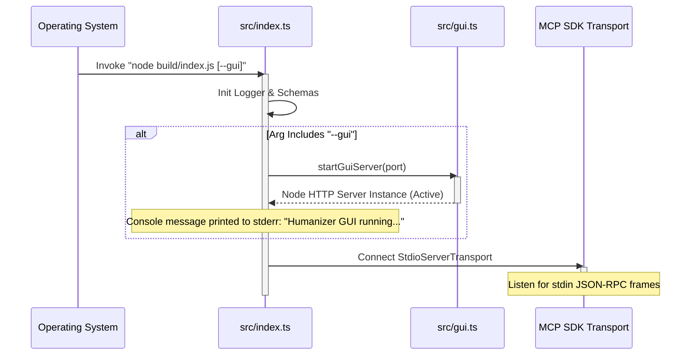
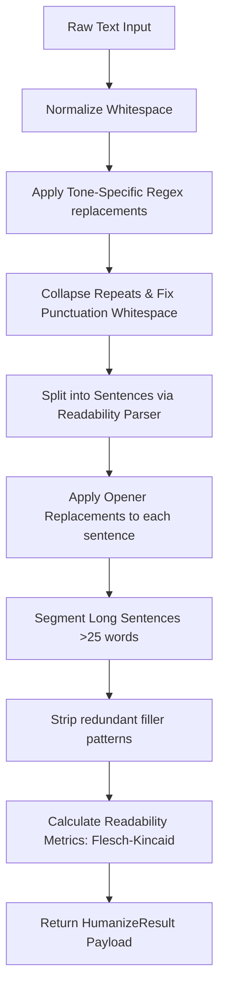

# AI Humanizer & MCP Server: Architectural Blueprint & Technical Breakdown

This document provides a textbook-level architectural breakdown of the **AI Humanizer & MCP Server** codebase. It is designed to get a Principal Systems Architect or Senior Staff Engineer up to speed on the core business domain, system boundaries, code skeleton, execution mechanics, and operational complexities.

---

## Phase 1: The Executive Blueprint

### 1. The Core Problem
Generative AI writing (e.g., LLM outputs) often exhibits statistical and stylistic patterns (clichés, predictable sentence lengths, passive voice) that make it easily flaggable by classifiers (like Copyleaks) or read as unnatural to humans. 

This repository solves this problem by providing a **dual-interface, hybrid text rewriting utility** that strips out typical AI idioms, shortens convoluted sentences, dynamically injects casual/creative/technical syntax depending on the target tone, and tracks Flesch-Kincaid readability metrics. It functions both as an **interactive web-based GUI** and as an **integration-ready Model Context Protocol (MCP) server** for AI assistants (like Claude).

### 2. High-Level Tech Stack

```mermaid
graph TD
    subgraph Client Tier
        Browser[Client Browser / Retro-Terminal UI]
        MCPClient[MCP Client e.g. Claude Desktop / Antigravity]
    end

    subgraph Host Application (Node.js/TypeScript Engine)
        Index[src/index.ts - Main Entry Point]
        GuiServer[src/gui.ts - HTTP Server]
        MCPServer[MCP Server - SDK Registry]
        LocalEngine[src/humanize.ts - Rules-based Rewrite Core]
    end

    subgraph External Dependencies
        EdgeShop[EdgeShop AI Core - https://api.edgeshop.ai]
    end

    Browser -->|HTTP POST /api/humanize| GuiServer
    MCPClient -->|STDIO JSON-RPC 2.0| MCPServer
    GuiServer -->|Call Engine / Pro Mode| LocalEngine
    MCPServer -->|Call Engine / Pro Mode| LocalEngine
    LocalEngine -.->|HTTP POST Fallback| EdgeShop
    GuiServer -.->|HTTP POST Pro Mode| EdgeShop
```

*   **Runtime:** Node.js (v20 Alpine for production Docker builds).
*   **Language:** TypeScript (configured for ES modules in `tsconfig.json`).
*   **Protocol Support:** Model Context Protocol (MCP) SDK v1.x (via JSON-RPC over `stdio` transport).
*   **Web Framework:** Vanilla Node.js `http` module. No heavy frameworks (like Express or Fastify) are utilized; routing and payload parsing are written using native Node streams to minimize bundle size.
*   **UI/Styling:** Tailwind CSS (loaded via CDN) coupled with custom CRT scanline/glow styles. Monospaced rendering utilizes the `Fira Code` typography.
*   **Validation:** Zod (`z`) for runtime request validation and schema definition.
*   **External Integration:** Upstream semantic AI rewrite engine hosted at `https://api.edgeshop.ai`.

---

## Phase 2: The Skeleton & Entry Points

### 1. Macro Directory Structure
The workspace is intentionally lightweight, featuring a flat `src/` directory containing all logic, eliminating boilerplate nesting:

*   **`/src`**: Contains all TypeScript source code.
    *   [`index.ts`](file:///workspaces/humanizer/src/index.ts): Main CLI execution context and MCP SDK Server setup.
    *   [`gui.ts`](file:///workspaces/humanizer/src/gui.ts): Embedded HTTP static asset server and API router.
    *   [`humanize.ts`](file:///workspaces/humanizer/src/humanize.ts): State machine and processing orchestrator for rewriting.
    *   [`patterns.ts`](file:///workspaces/humanizer/src/patterns.ts): Constant dictionary of regex replacements mapped to target styles.
    *   [`readability.ts`](file:///workspaces/humanizer/src/readability.ts): Flesch-Kincaid reading ease and grade calculator.
    *   [`logger.ts`](file:///workspaces/humanizer/src/logger.ts): Simple global logging utility with severity level filtering.
    *   [`errors.ts`](file:///workspaces/humanizer/src/errors.ts): Custom domain exceptions (`ValidationError`, `NetworkError`, etc.).
*   **`/build`**: Compiled target output (JavaScript ES Modules) generated by the TypeScript compiler (`tsc`).
*   **`Dockerfile`**: Defines a two-stage build pipeline (`builder` and `runtime`) targeting `node:20-alpine`.

### 2. Execution Entry Points & Lifecycle
The application lifecycle begins at [`src/index.ts`](file:///workspaces/humanizer/src/index.ts).



*   **Dual Bootstrapping:** The process starts the MCP server over standard input/output (`StdioServerTransport`). If the `--gui` command-line argument is passed, it concurrently spawns the HTTP daemon.
*   **GUI Process Teardown:** A `process.on("exit")` trap is registered in `index.ts` to cleanly invoke `.close()` on the HTTP server to release the socket.

---

## Phase 3: Data Flow & Architectural Mechanics

### 1. The Humanization Pipeline (Local Rule-Based Mode)
When a rewrite request is received, the data undergoes sequential processing:



### 2. Trace: Web UI to Output

1.  **Request Dispatch:** The user enters text in the text area of the HTML app served from [`src/gui.ts`](file:///workspaces/humanizer/src/gui.ts#L174) and clicks **RUN HUMANIZER_PROTOCOL**.
2.  **Schema Validation:** An AJAX `POST` is sent to `/api/humanize`. The request schema is checked via Zod:
    ```typescript
    const GuiRequestSchema = z.object({
      text: z.string().min(1),
      style: z.enum(["balanced", "casual", ...]).optional(),
      proMode: z.boolean().optional(),
    });
    ```
3.  **Pro Mode Check (Conditional Gateway):**
    *   **Pro Mode = `true`:** The application executes a remote `fetch` call to the external EdgeShop rewrite API (`https://api.edgeshop.ai/rewrite/humanize`). If this uplink succeeds, it returns the semantic rewriting result.
    *   **Pro Mode = `false` or Network Failure:** The server falls back to [`humanizeText()`](file:///workspaces/humanizer/src/humanize.ts#L136), executing the local pipeline.
4.  **Local Pipeline Processing:**
    *   Regex matches in [`patterns.ts`](file:///workspaces/humanizer/src/patterns.ts) map patterns like `\bin order to\b` to `to` or `\bdelve into\b` to `look at`.
    *   Long sentences are split: sentences over 25 words find a breakpoint at the closest comma or semicolon, breaking them into two distinct sentences.
    *   Flesch-Kincaid grade levels are calculated before and after inside [`src/readability.ts`](file:///workspaces/humanizer/src/readability.ts#L34).
5.  **Streaming & Logging:** The result payload is returned to the client browser, which simulates a console output using a client-side typewrite animation, while listing each transformation inside the `#EXECUTION_LOG` panel.

### 3. Core Architectural Patterns

*   **Model Context Protocol (MCP) Server Pattern:** Exposes two core capabilities (tools) to downstream LLM orchestrators:
    1.  `detect`: Interrogates third-party analysis tools (Copyleaks, Hemingway) via an EdgeShop proxy to judge AI-ness.
    2.  `humanize`: Runs local-first or cloud-enabled rewriting.
*   **Rules Engine Pattern:** Local text processing avoids heavy machine learning libraries. It relies on deterministic regular expressions mapped to styles (`balanced`, `casual`, `formal`, `professional`, `technical`, `creative`).
*   **Graceful Degradation Pattern:** If "Pro Mode" is requested but fails due to lack of internet access or API downtime, the system catches the exception, logs it, and falls back transparently to the local regex rules engine.

---

## Phase 4: Critical Complexities & "Gotchas"

### 1. The Dynamic Sentence Splitter
Unlike high-level NLP libraries (like compromise or natural), this system uses a lightweight regular expression splitter in [`src/readability.ts`](file:///workspaces/humanizer/src/readability.ts#L25-L28):
```typescript
export function splitSentences(text: string): string[] {
  const pieces = text.match(/[^.!?]+[.!?]*/g);
  return pieces?.length ? pieces.map((piece) => piece.trim()).filter(Boolean) : [text];
}
```
> [!WARNING]
> **Gotcha:** This splitter split sentences strictly on periods, question marks, and exclamation marks. Abbreviations (e.g., "Mr.", "e.g.", "Dr.") or decimals (e.g., "1.0.7") will trigger false positives, segmenting a single logical sentence into fragment chunks.

### 2. Syllable Counting Heuristics
Readability scoring relies on `countSyllables()` in [`src/readability.ts`](file:///workspaces/humanizer/src/readability.ts#L12-L23), which operates on character heuristics rather than a dictionary lookup:
```typescript
word = word.replace(/(?:[^laeiouy]es|ed|[^laeiouy]e)$/, "");
word = word.replace(/^y/, "");
const matches = word.match(/[aeiouy]{1,2}/g);
```
While highly performant, it is an approximation of English orthography and will deviate from perfect phonetic syllable counts on complex English words.

### 3. Stdio Collision Risk in MCP Mode
Because the MCP protocol communicates over standard input (`stdin`) and standard output (`stdout`), any rogue `console.log()` calls written to stdout will corrupt the JSON-RPC stream, breaking the client connection.
> [!IMPORTANT]
> Any auxiliary logs, trace messages, or server notifications MUST be directed exclusively to `stderr` or the logger class, which routes `console.error` for errors and standard console outputs to `stderr` depending on configuration.

### 4. EdgeShop AI External Dependency
The "Pro Mode" rewrite and the "detect" tools both send raw text over the internet to `https://api.edgeshop.ai`. 
*   **Privacy note:** In standard (non-Pro) mode, all data processing occurs entirely within the local node process boundaries. Clicking "Pro Mode" or invoking the `detect` tool will stream data to EdgeShop.
*   **Timeouts:** The network request has a hard-coded client timeout of **30,000 milliseconds** (`30s`), handled by an `AbortController` in [`index.ts`](file:///workspaces/humanizer/src/index.ts#L111).
