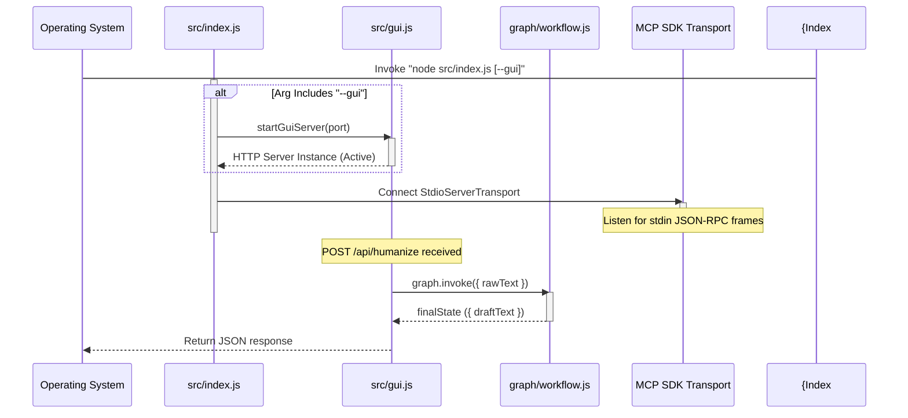
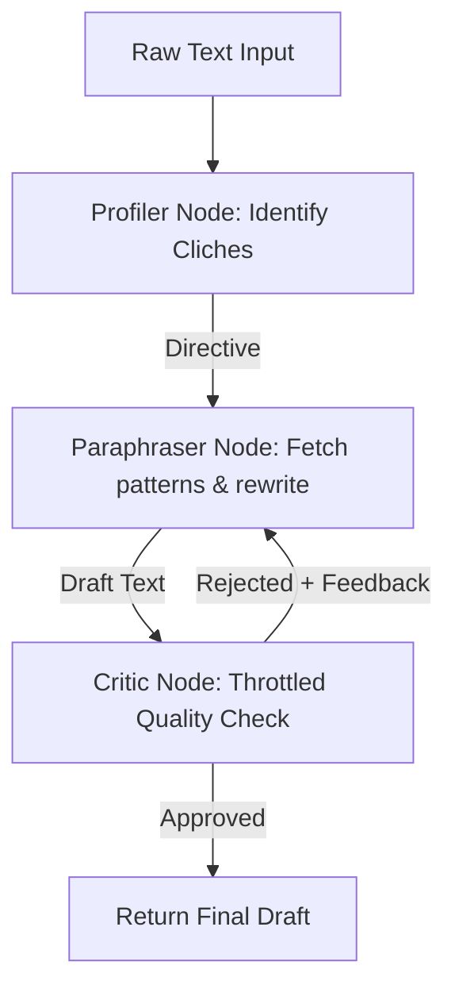

# AI Humanizer & MCP Server: Architectural Blueprint & Technical Breakdown

This document provides a textbook-level architectural breakdown of the **AI Humanizer & MCP Server** codebase. It is designed to get a Principal Systems Architect or Senior Staff Engineer up to speed on the core business domain, system boundaries, code skeleton, execution mechanics, and operational complexities.

---

## Phase 1: The Executive Blueprint

### 1. The Core Problem
Generative AI writing (e.g., LLM outputs) often exhibits statistical and stylistic patterns (clichés, predictable sentence lengths, passive voice) that make it easily flaggable by classifiers or read as unnatural to humans. 

This repository solves this problem by providing a **dual-interface, hybrid text rewriting utility** that strips out typical AI idioms, shortens convoluted sentences, dynamically injects casual/creative/technical syntax depending on the target tone, and tracks Flesch-Kincaid readability metrics. It functions both as an **interactive web-based GUI** and as an **integration-ready Model Context Protocol (MCP) server** for AI assistants.

### 2. High-Level Tech Stack

```mermaid
graph TD
    subgraph Client Tier
        Browser[Client Browser / Retro-Terminal UI]
        MCPClient[MCP Client e.g. Claude Desktop / Antigravity]
    end

    subgraph Host Application (Node.js/ES6 Engine)
        Index[src/index.js - Main Entry Point]
        GuiServer[src/gui.js - HTTP Server]
        MCPServer[mcp-server/index.js - MCP SDK Server]
        Workflow[graph/workflow.js - LangGraph Orchestrator]
    end

    subgraph LangGraph Multi-Agent Workflow
        Profiler[agents/profiler.js - Qwen/Qwen2.5-7B-Instruct]
        Paraphraser[agents/paraphraser.js - meta-llama/Meta-Llama-3-8B-Instruct]
        Critic[agents/critic.js - meta-llama/Meta-Llama-3-8B-Instruct]
    end

    Browser -->|HTTP POST /api/humanize| GuiServer
    MCPClient -->|STDIO JSON-RPC 2.0| MCPServer
    GuiServer -->|Invoke workflow| Workflow
    Workflow --> Profiler
    Profiler -->|Directive| Paraphraser
    Paraphraser -->|Draft Text| Critic
    Critic -->|Rejected + Feedback| Paraphraser
    Critic -->|Approved| Workflow
    Paraphraser -.->|Fetch patterns tool call| MCPServer
```

*   **Runtime:** Node.js (v20 Alpine).
*   **Language:** Vanilla JavaScript (ES6 ESModules).
*   **Protocol Support:** Model Context Protocol (MCP) SDK v1.x (via JSON-RPC over `stdio` transport).
*   **Agentic Orchestration:** `@langchain/langgraph` (v1.x) managing StateGraph cycles.
*   **Inference Pipeline:** `@langchain/community/llms/hf` and `@huggingface/inference` invoking Hugging Face Serverless API endpoints (`Qwen/Qwen2.5-7B-Instruct` and `meta-llama/Meta-Llama-3-8B-Instruct`).
*   **Validation:** Zod (`z`) for runtime request validation and MCP tool schema checking.

---

## Phase 2: The Skeleton & Entry Points

### 1. Macro Directory Structure
The workspace is structured entirely in ES6 vanilla JS modules:

- **`/src`**: Contains primary bootstrapper code.
    - [`index.js`](file:///workspaces/agentic-humanizer/src/index.js): Main CLI execution context and MCP SDK Server setup.
    - [`gui.js`](file:///workspaces/agentic-humanizer/src/gui.js): Embedded HTTP server and API router (triggers the LangGraph workflow).
    - [`humanize.js`](file:///workspaces/agentic-humanizer/src/humanize.js): Classical rules-based pipeline.
    - [`patterns.js`](file:///workspaces/agentic-humanizer/src/patterns.js): Constant dictionaries of style regex patterns.
    - [`readability.js`](file:///workspaces/agentic-humanizer/src/readability.js): Flesch-Kincaid calculator.
    - [`logger.js`](file:///workspaces/agentic-humanizer/src/logger.js): Simple global logger.
    - [`errors.js`](file:///workspaces/agentic-humanizer/src/errors.js): App validation and processing exceptions.
- **`/mcp-server`**: Contains local MCP components.
    - [`index.js`](file:///workspaces/agentic-humanizer/mcp-server/index.js): Exposes the `get_humanizer_patterns` tool with strict Zod validation.
- **`/agents`**: LangGraph nodes.
    - [`profiler.js`](file:///workspaces/agentic-humanizer/agents/profiler.js): Analyzes raw text style.
    - [`paraphraser.js`](file:///workspaces/agentic-humanizer/agents/paraphraser.js): Rewrites draft using patterns and LLM instructions.
    - [`critic.js`](file:///workspaces/agentic-humanizer/agents/critic.js): Reviews quality and controls loop iteration.
- **`/graph`**: LangGraph state definitions.
    - [`workflow.js`](file:///workspaces/agentic-humanizer/graph/workflow.js): StateGraph compilation.

### 2. Execution Entry Points & Lifecycle
The application lifecycle begins at [`src/index.js`](file:///workspaces/agentic-humanizer/src/index.js).



---

## Phase 3: Data Flow & Agentic Mechanics

### 1. The Multi-Agent Humanization Loop
When a rewrite request hits the HTTP API router, the data undergoes loop-based processing:



### 2. State & Channels
The StateGraph state is defined with vanilla JavaScript config channels:
- `rawText`: The input machine-written text.
- `directive`: Instruction guideline set by the profiler and amended with feedback by the critic.
- `draftText`: The working copy of the humanized output.
- `status`: Transition flag (`"approved"` or `"rejected"`) evaluated by the critic.

### 3. Loop Throttling
In `agents/critic.js`, the review cycle is throttled using a 2000ms delay:
```javascript
await new Promise((resolve) => setTimeout(resolve, 2000));
```
This reduces execution speed when looping in test pipelines and prevents hitting serverless API rate limits.

### 4. Dynamic MCP Patterns & Tool Binding
To resolve word/phrase replacement rules dynamically from the MCP server:
- The **Paraphraser** defines a LangChain tool schema using Zod that requires a `tone` parameter.
- It instantiates a `ChatHuggingFace` wrapper to bind this tool using `.bindTools([toolSchema])`.
- It dynamically queries the local MCP server over stdio using `get_humanizer_patterns` with the tone parameter extracted from the `directive` (casual, formal, or balanced).
- The **MCP Server** imports `src/patterns.js`, validates arguments via Zod, and queries the patterns. Since JS RegExp objects do not serialize directly to JSON, the MCP server maps RegExp instances using their `.source` string property.
- The Paraphraser formats these retrieved regex rules and injects them directly into the Llama-3 system prompt, guiding the model's rewriting pass.

---

## Phase 4: Critical Complexities & "Gotchas"

### 1. Stdio Collision Risk in MCP Mode
Because the MCP protocol communicates over standard input (`stdin`) and standard output (`stdout`), any rogue `console.log()` calls written to stdout will corrupt the JSON-RPC stream, breaking the client connection.
> [!IMPORTANT]
> Any auxiliary logs, trace messages, or server notifications MUST be directed exclusively to `stderr` or a logger writing to `stderr`.

### 2. Hugging Face Serverless API Key Initialization
The LangChain `HuggingFaceInference` class throws an error at module load time if `apiKey` is empty or undefined.
- **Gotcha Fix:** All Hugging Face model client instantiations are performed **lazily** inside the node functions. If the environment token (`process.env.HUGGINGFACEHUB_API_TOKEN`) is missing, they write descriptive warning logs to `stderr` and fallback to rule-based operations.

### 3. Pure JavaScript Deployment
Because there is no TypeScript compilation step, the `build` script in `package.json` simply ensures that `src/index.js` is executable (`chmod +x`). Docker runtime layers copy the `/src`, `/mcp-server`, `/agents`, and `/graph` files directly, accelerating container bootstrap time and lowering runtime image overhead.
